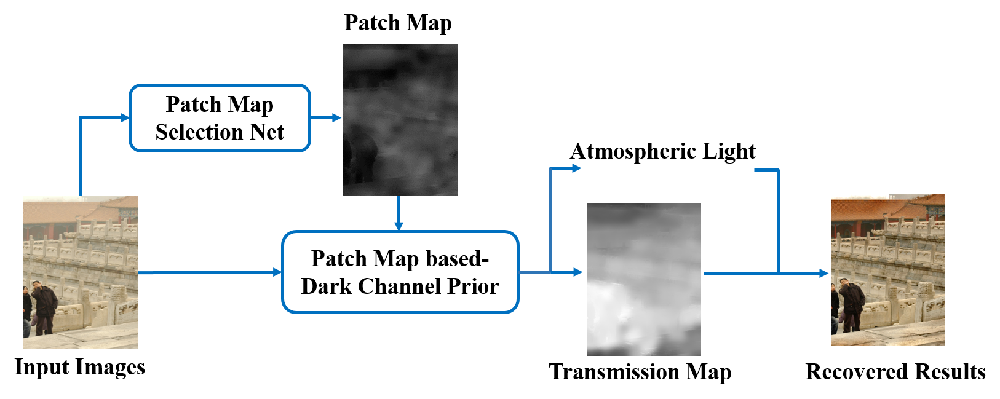

# PMS-Net: Robust Haze Removal Based on Patch Map for Single Images

**Wei-Ting Chen, Jian-Jiun Ding, Sy-Yen Kuo**

The IEEE Conference on Computer Vision and Pattern Recognition (CVPR), 2019, pp. 11681-11689  
[[Paper Download]](https://openaccess.thecvf.com/content_CVPR_2019/html/Chen_PMS-Net_Robust_Haze_Removal_Based_on_Patch_Map_for_Single_CVPR_2019_paper.html/)
[[Code Download]](https://github.com/weitingchen83/PMS-Net)  
<br>

You can also refer our related works on dehazing:

<br>

1."PMHLD: Patch Map Based Hybrid Learning DehazeNet for Single Image Haze Removal" which has been published in **TIP 2020**.  
[[Paper Download]](https://ieeexplore.ieee.org/document/9094006)
[[Code Download]](https://github.com/weitingchen83/Dehazing-PMHLD-Patch-Map-Based-Hybrid-Learning-DehazeNet-for-Single-Image-Haze-Removal-TIP-2020)  

and

2."JSTASR: Joint Size and Transparency-AwareSnow Removal Algorithm Based on ModifiedPartial Convolution and Veiling Effect Removal" which has been published in **ECCV 2020**.  
[[Paper Download]]()
[[Code Download]](https://github.com/weitingchen83/JSTASR-DesnowNet-ECCV-2020)  


# Abstract
In this paper, we proposed a novel haze removal algorithm based on a new feature called the patch map. Conventional patch-based haze removal algorithms (e.g. the Dark Channel prior) usually performs dehazing with a fixed patch size. However, it may produce several problems in recovered results such as oversaturation and color distortion. Therefore, in this paper, we designed an adaptive and automatic patch size selection model called the Patch Map Selection Network (PMS-Net) to select the patch size corresponding to each pixel. This network is designed based on the convolutional neural network (CNN), which can generate the patch map from the image to image. Experimental results on both synthesized and real-world hazy images show that, with the combination of the proposed PMS-Net, the performance in haze removal is much better than that of other state-of-the-art algorithms and we can address the problems caused by the fixed patch size.
proposed algorithm performs favorably against the stateof-the-art algorithms.

# Setup and environment

To generate the recovered result you need:
1. Python 3 
2. Keras
3. CUDA >= 9.0
4. opencv-python

All the hazy inputs and recovered results are put in the "image" and "result" folder, respectively.

Run the test.py to generate recovered results

```
$ python test.py
```
The pretrained model can be downloaded from: https://drive.google.com/drive/folders/12cKqlfT7ckxwgB-xBdU5TF7Cc5-hssOg?usp=sharing


# Citations
Please cite this paper in your publications if it helps your research:    

Bibtex:
```
@inproceedings{chen2019pms,
  title={PMS-Net: Robust Haze Removal Based on Patch Map for Single Images},
  author={Chen, Wei-Ting and Ding, Jian-Jiun and Kuo, Sy-Yen},
  booktitle={Proceedings of the IEEE Conference on Computer Vision and Pattern Recognition},
  pages={11681--11689},
  year={2019}
}
```
Thanks Cheng-Che Tsai for rewriting this version of code!

